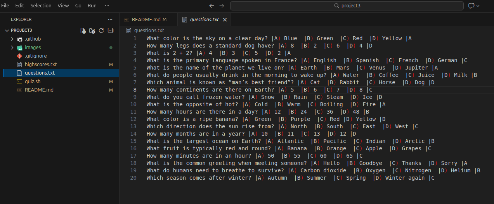
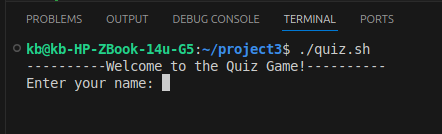
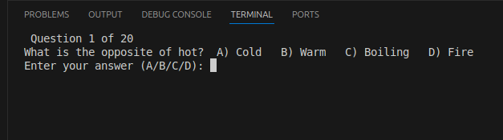
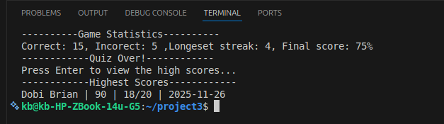
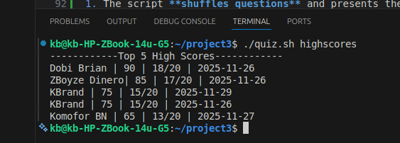

# Terminal Quiz Game

A simple **terminal bash quiz game** that allows users to practice multiple-choice questions, track high scores, and view game statistics.

---

## Features

- **Play a quiz** with 20 randomized multiple-choice questions.
- **Practice mode** to answer questions immediately after each guess and does not track high scores.
- **High scores** tracking top 5 players with name, score, and date having highest score.
- **Longest correct streak** tracking during each game.
- **Input validation** to ensure answers are A, B, C, or D.

---

## Requirements

- Linux or macOS terminal with **Bash** installed.
- `questions.txt` file containing questions in the following format:

```
Question?| A) Option1 | B) Option2 | C) Option3 | D) Option4 | CorrectAnswerLetter
```


*Fields are separated by "|" . The last field represents the correct answer letter*

- `highscores.txt` file (created automatically if not present).

---

## How to Use

1. Make the script executable:

```bash
chmod +x quiz.sh
```

2. Run the script:

```bash
./quiz.sh
```

3. You will be prompted to **enter your name** and then answer 20 questions.


4. Input your answer as **A, B, C, or D**.


5. After finishing, the game will display:

- Correct answers
- Incorrect answers
- Longest streak
- Final score
- Top high scores


---

### Optional Arguments

You can run the script with the following arguments:

- **Practice Mode**:

```bash
./quiz.sh practice
```

- **View Top 5 High Scores**:

```bash
./quiz.sh highscores
```


---

## Files

- `quiz.sh` — main script.
- `questions.txt` — text file containing all the questions and answers.
- `highscores.txt` — text file storing high scores (automatically updated).

---

## How It Works

1. The script **shuffles questions** and presents them one by one.
2. It **validates user input** to ensure only A, B, C, or D are accepted.
3. Displays whether the answer is **correct or incorrect** immediately.
4. Tracks:
- Total correct answers
- Longest streak of correct answers
5. Saves the final score and statistics to `highscores.txt`.

---

## Notes
- **Green** for correct answers
- **Red** for incorrect answers
- High scores are sorted by **score in descending order**.